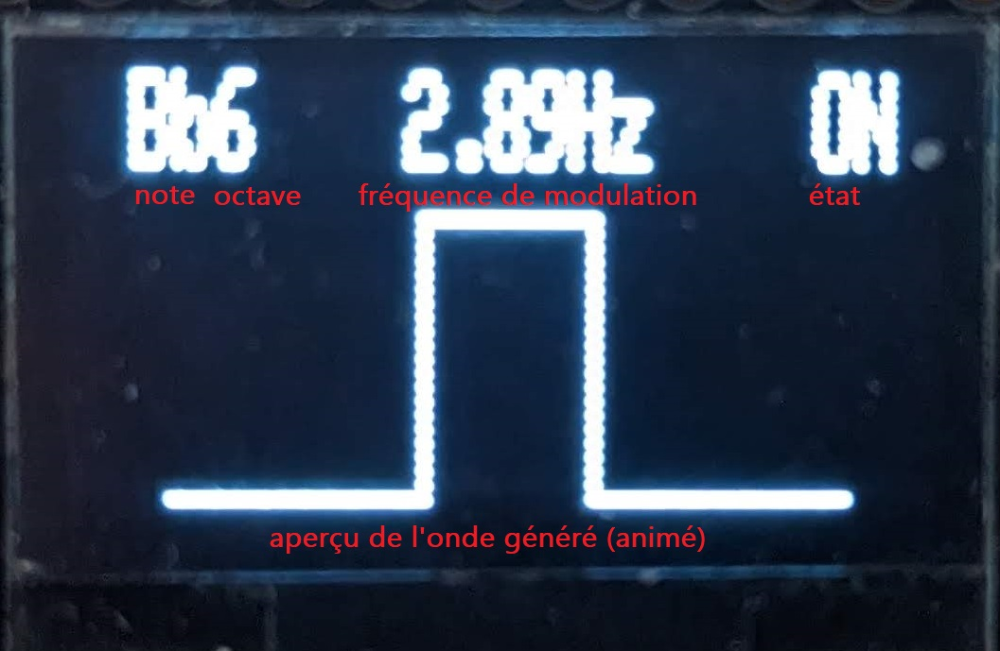
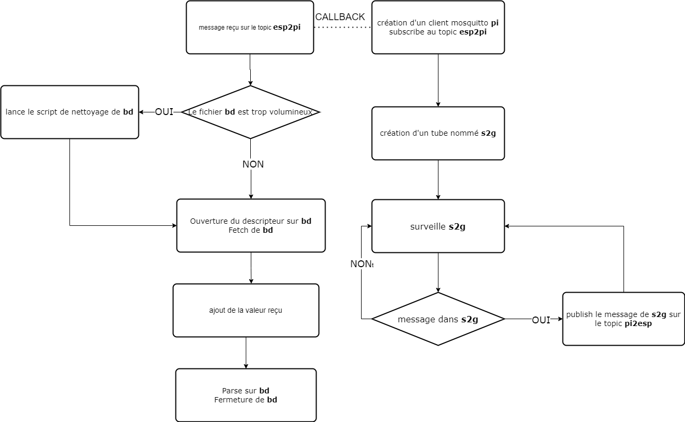
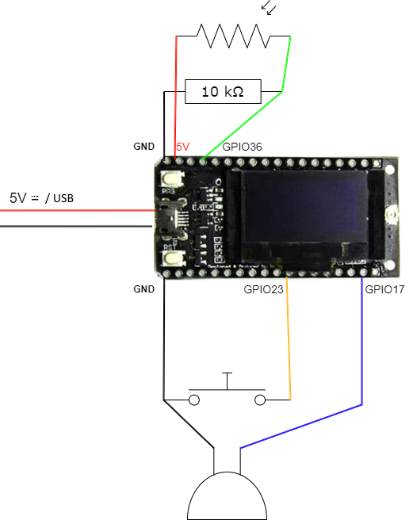
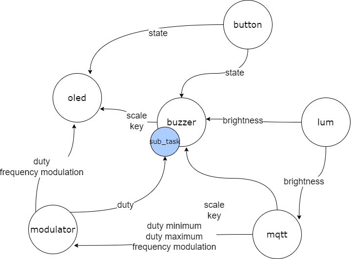

# Projet IOC : Le WEB serveur photo-synthétiseur

## **Introduction**

Dans le cadre de l'UE IOC en M1 informatique à Sorbonne Université, nous avons vu au cours du semestre comment créer des applications et contrôleur sur des systèmes embarqués tel que le Raspberry PI et l'ESP32. Nous avons aussi vu comment faire communiquer différents systèmes répartis via différents protocoles internet, communication inter-processus et interfacer le tout via une page WEB. Pour conclure les TME effectués au cours du semestre, nous vous proposons un projet compilant presque l'ensemble des points aventurés en cours. La synthèse sonore est un domaine qui nous attire particulièrement, notre projet portera sur un ensemble de photo-synthétiseur contrôlé via un serveur WEB. Dans ce document, nous ferons d'abord une présentation de l'ensemble de l'architecture du système, puis nous nous intéresserons à chacun des composants de son architecture en décrivant brièvement les points qui nous semblent les plus importants.

## **Présentation**

Nous avons l'honneur de vous présenter le Web serveur photo-synthétiseur ! C'est un dispositif qui permet de synthétiser un signal sonore en fonction de la luminosité, l'utilisateur pourra paramétrer le son synthétisé via une page internet. Ce système est mis en œuvre par deux appareils, communiquant l'un avec l'autre via un protocole MQTT ; Un micro-contrôleur ESP32 qui génère un signal sonore et un micro-ordinateur Raspberry PI déployant un serveur de communication et une interface WEB. Il est éventuellement possible de contrôler plusieurs photo-synthétiseurs via l'interface WEB (pas encore implémentée). Les cas d'utilisation sont multiples :

* Un instrument de musique minimal et ludique faisant penser à un [thérémine](https://www.youtube.com/watch?v=l-rlFaSBLg8)
* Chaîner plusieurs photo-synthétiseurs pour une installation dynamique dans une exposition par exemple
* Un dispositif photosensible pour les malvoyants, pour détecter des mouvements dans une pièce allumé par exemple

<table>
  <tr>
   <td>


   </td>
  </tr>
  <tr>
   <td>
    <em>L'Architecture générale du système </em>
    <p></p>
    <em>Les flèches représentent une communication, le label indique la nature de la communication.</em>
   </td>
  </tr>
</table>

Le principe de fonctionnement du système est le suivant :

* ESP32 et ses composants (photo-synthétiseur) : génère via le buzzer un signal carré en fonction de la luminosité reçue par une photorésistance, on peut allumer et éteindre le signal via un bouton et un écran OLED indique les informations concernant l'onde émise. Il intègre un client MQTT **esp**.
* Raspberry PI (serveur) : fait office de serveur WEB qui fournit une interface pour le ou les utilisateurs, un échangeur de requête MQTT et une passerelle pour les communications entre l'échangeur, le serveur et les ESP32.
* MQTT client **esp** : un client MQTT connecté au port et à l'adresse du broker MQTT du Raspberry PI, il publie sur le sujet **esp2pi** et est abonné au sujet **pi2esp**.
* Broker MQTT : un échangeur (serveur) MQTT redirigent les publications de chaque client connecté.
* _gatewayMQTT_ : passerelle lançant un client MQTT **pi** et crée un tube nommé **s2g**, il permet de faire correspondre les requêtes du serveur à **pi** et d'écrire les requêtes arrivant à **pi** dans une base de données _bd.json_.
* MQTT client **pi** : un client MQTT connecté au port et à l'adresse du broker MQTT du Raspberry PI, il publie sur le sujet **pi2esp** et est abonné au sujet **esp2pi**.
* _server.py_ : script lançant un serveur CGI, la page HTML/JavaScript fourni est affiché par _main.py_ qui écrit les requêtes des formulaires dans le tube nommé **s2g**, et lit la base de données _bd.json_ du répertoire bd pour l'afficher sur la page.
* bd : répertoire contenant les bases de données des informations reçues par le client **esp**, ce répertoire est visible depuis le site WEB.
* Utilisateur et sa machine : l'utilisateur du dispositif ouvre la page WEB fournit par le serveur sur sa machine (PC ou smartphone) pour paramétrer le photo-synthétiseur. Il peut interagir avec le photo-synthétiseur en faisant varier la luminosité reçue par celui-ci.
* Réseaux : réseaux par lequel les requêtes HTTP et MQTT(TCP) sont envoyées, il peut s'agir aussi bien d'un réseau local qu'une communication par internet.

Les informations circulant du serveur aux photo-synthétiseurs contiennent le duty minimale et maximale pour la forme d'onde, la fréquence de modulation de la forme d'onde, la gamme à jouer et la clé. Les informations circulant des photo-synthétiseurs au serveur contiennent la luminosité captée par les photo-synthétiseurs.

Le système a différentes capacités :

* Le photo-synthétiseur joue une note dans la gamme et la clé sélectionnée, il est facile d'en ajouter au programme.
* La plage de modulation est bornée par le duty minimale et maximale, si elle vaut 0, l'onde produite aura un duty égale à la longueur entre les bornes.
* Le gateway gère tout seul la taille des bases de données produites pour économiser les ressources du côté client et alléger les traitements dans le serveur.
* Tous les sons produits sont entièrement synthétisés et non pré-programmés.
* L'utilisateur a à tout instant les informations dont il a besoin s'il corrèle l'interface du photo-synthétiseur et de la page WEB.

<table>
  <tr>
   <td>


   </td>
  </tr>
  <tr>
   <td>
    <em>Capture d'écran annotée de l'interface WEB</em>
   </td>
  </tr>
</table>

<table>
  <tr>
   <td>



   </td>
  </tr>
  <tr>
   <td>
    <em>Photo annotée de l'écran OLED du photo-synthétiseur</em>
   </td>
  </tr>
</table>

### **Dépendances**

Mosquitto pour le broker MQTT :

```console
sudo apt-get install mosquitto mosquitto-clients
```

Lib mosquitto pour compiler un client MQTT :

```console
sudo apt-get update sudo apt-get install libmosquitto-dev
```

PubSubClient pour Arduino IDE :  

```console
git clone https://github.com/knolleary/pubsubclient
```

Tutoriel pour l’installation de la carte TTGO Lora32 SX1276 :

```console
xdg-open https://randomnerdtutorials.com/ttgo-lora32-sx1276-arduino-ide/
```

### **Démarrage**

Sur le Raspberry PI (ou tout autre machine pouvant faire office de server)

Démarrage de mosquitto :

```console
cd rasp/gateway
mosquitto -c mosquitto.conf
```

Compilation et lancement du gateway :

```console
cd rasp/gateway
make && sudo ./gatewayMQTT
```

lancement du server :

```console
cd rasp/server/www
sudo python3 ../server.py
```

## **Raspberry Pi : WEB Server et Gateway**

Nous verrons dans cette partie les bases du fonctionnement interne du serveur lancé par le script _server.py_ et du gateway lancé par le programme _gatewayMQTT_.

### **Server**

Le script _server.py_ est l'élément qui lie l'interface utilisateur au gateway.

#### **CGI**

Common Gateway Interface est un protocole qui permet la communication entre un serveur web et des applications externes. Il s'agit d'une norme qui définit comment un serveur web sur un certain port (et pour une certaine adresse) peut transmettre des informations à une application. Il peut traiter les requêtes de l'utilisateur et renvoyer les résultats au serveur web pour qu'ils soient affichés dans le navigateur via des requêtes HTTP (PUT et GET).

Ici _server.py_ lance un protocole CGI sur le port 8080 à l'adresse de la machine. Si on se connecte à cette adresse via ce même port, la page web affichée (_www/index.html_) est un script _www/cgi-bin/main.py_ qui ouvre le tube nommé _/tmp/s2g_ (pour "server to gateway") pour y mettre les informations du formulaire.

#### **HTML**

HyperText Markeup Language est un langage à balise permettant de structurer une page WEB, il s'exécute conjointement avec du code CSS et JavaScript.

Le script _www/cgi-bin/main.py_ imprime sur le navigateur, une page web minimaliste (dans lequel est exécuté des scripts JavaScript) qui fournit un formulaire à l'utilisateur, sous forme de slider et de liste dropdown. Il permet aussi de fournir des conteneurs pour les graphiques et les dessins.

#### **JavaScript**

JavaScript est un langage de programmation utilisé principalement pour le développement WEB. Il est exécuté côté client, c'est-à-dire dans le navigateur de l'utilisateur. JavaScript permet d'ajouter de l'interactivité et de la dynamique aux pages web en permettant la manipulation du contenu HTML, le contrôle des événements et l'accès à des fonctionnalités avancées du navigateur.

Notre code JavaScript est encapsulé dans la page HTML précédemment imprimée. Elle appelle des fonctions définies dans _www/src/js/func.js_ pour fetch la base de données _www/bd/bd.json_. Dès qu'elle est modifiée, elle récupère le champ **coordonnées** pour afficher son contenu dans un graphique, utilise JQuerry pour mettre en forme le formulaire et ses fonctionnalités. Pour finir, dessine dans un canvas la prévisualisation de la forme d'onde.

### **Gateway**

Le programme _gatewayMQTT_ écrit en C est une "passerelle" ou "porte", qui permet de mettre en lien les messages entre l'ESP32 et le serveur et de faire circuler des informations dans le système de fichier interne du Raspberry PI.

<table>
  <tr>
   <td>

   </td>
  </tr>
  <tr>
   <td>
    <em>Organigramme de l'organisation du code du gateway</em>
   </td>
  </tr>
</table>

#### **MQTT**

Comme dit précédemment, la nature des communications via le réseau des messages passe par le protocole MQTT.

Message Queuing Telemetry Transport est un protocole de messagerie léger conçu pour les environnements à faible bande passante et à faible puissance. Ce protocole est basé sur les sockets TCP et est donc parfait pour notre architecture.

Ce protocole fonctionne de manière simple : un broker (échangeur) tournant sur une machine achemine les messages des clients vers d'autres clients, les clients qui sont "subscribe" à un topic reçoivent tous les messages sur ce même topic. Les clients peuvent ensuite "publish" un message sur le topic qu'ils souhaitent.

Nous avons choisi d'utiliser la bibliothèque C mosquitto, qui offre des fonctions très simples pour la création d'un client et la gestion des messages. Mosquitto crée un thread surveillant l'arrivée et l'envoi d'un message et gère aussi la connexion et déconnexion des clients créés.

Dans notre programme, le client pi est abonné à esp2pi (pour "esp to pi") et publi sur pi2esp (vous l'avez).

Le broker lui, est un programme distinct qui dans notre cas s'exécute sur la même machine.

#### **Pipe**

Les pipe ou "tubes" sont un mécanisme du système de fichier qui permettent la communication inter-processus. Ils fonctionnent tel un FiFo : on push une information dans un programme est on pull l'information chez l'autre. En utilisant les pipes il faut veiller à ne pas inter-bloquer nos programmes.

Dans notre programme, le pipe créé est un tube nommé _/tmp/s2g_, c.-à-d. qu'il est visible par tous les processus ouvrant un descripteur de fichier dessus. On l'ouvre alors en lecture, car c'est le serveur qui push dedans. La LibC offre la possibilité de surveiller un descripteur dans une boucle. S'il y a une nouvelle information à pull du tube, on l'extrait, comme ça, on ne se bloque pas sur la lecture d'un tube vide. S'il y a une information à lire, notre client MQTT la publie.

#### **JSON**

JavaScript Object Notation est un format léger d'échange de données largement utilisé dans le développement web. Il est basé sur la syntaxe des objets JavaScript, mais peut être utilisé avec n'importe quel langage de programmation. Il a donc la particularité d'être facilement lisible par un humain ou par un programme. Cependant il prend beaucoup de place par rapport à d'autres formats (Binaire ou Protobuf de Google). Nous l'avons choisi, car nous le connaissons déjà et qu’il semblait être le plus rapide à mettre en œuvre au vu des nombreuses API existantes et de l'intégration native par JavaScript.

Pour sérialiser et désérialiser les données de la base de données, nous avons utilisé le code ultra léger et efficace [cJSON](https://github.com/DaveGamble/cJSON.git). Lorsque le thread du client MQTT reçoit un message, il appel un callback qui désérialise la base de données _www/bd/bd.json_, récupère un objet cJSON, ajoute la valeur reçue au champ **coordonees** et sérialise l'objet dans le fichier _www/bd/bd.json_. Cette partie du programme veille à ce que le fichier ne soit pas trop gros, sinon cela pourrait entraîner un trop long temps d'exécution et une grosse quantité de mémoire pour les buffers.

## **ESP32 : Synthétiseur connecté**

À présent, nous allons voir l'autre partie de l'architecture de notre système. Cette partie est plus orientée matériel. Le micro-contrôleur utilisé est le LILYGO TTGO Module LORA32 868/915Mhz SX1276 à l'architecture basé sur un ESP32.

<table>
  <tr>
   <td>



   </td>
  </tr>
  <tr>
   <td>
    Schéma de branchement de l'ESP32 et ses composants
<ul>

<li>Rouge : 5V courant continu pôle positif

<li>Noir : pôle négatif

<li>Bleu : Buzzer passif vers GPIO17

<li>Orange : Bouton poussoir vers GPIO23

<li>Vert : Photo-résistance vers GPIO36
</li>
</ul>
   </td>
  </tr>
</table>

### Programmation multitâche

Dans la programmation de micro-contrôleur, nativement, il n'y a pas de gestion de thread car il n'y a pas de système d'exploitation. Il est donc délicat d'ordonnancer des tâches sachant qu'attendre une ressource est critique pour le système (une boucle en attente bloque toutes les autres), pour cela on définit un système de tâche qui comprend :

* un pseudo-ordonnanceur dans _time.h_, la fonction `waitFor(numéro timer,periode en microsecondes)` renvoi le nombre de _periode_ écoulé depuis le dernier appel de cette fonction (dans la fonction principale d'une tâche) pour un numéro de _timer_donné
* une tâche est un header (_.h_) qui contient une structure dans lequel on retrouve toutes les variables internes d'une tâche ainsi que la fonction d'initialisation et la fonction principale
* une structure `struct mailbox_s` dans _flag.h_, dans lequel on retrouve un flag et une valeur. Cette valeur est partagée entre deux tâches en fonction de la disponibilité du flag.

<table>
  <tr>
   <td>


   </td>
  </tr>
  <tr>
   <td>
    <em>Automate représentant les communications inter-tâche programmées </em>
<p></p>
    <em>Une flèche noire représente une communication qui a pour objet son label </em>
<p></p>
    <em>Un cercle est une tâche et un cercle bleu est une tâche conditionnel</em>
   </td>
  </tr>
</table>

Voici les tâches qui s'exécutent :

* MQTT : initialise le WiFi et le client MQTT abonné au topic pi2esp. Cette tâche sérialise et communique les valeurs reçues du serveur aux tâches Modulator et Buzzer. Elle reçoit la valeur de la tâche Lum pour être publiée sur esp2pi.
* Lum : initialise la photorésistance et récupère sa valeur pour être communiquée au Buzzer.
* Modulator : fait varier le duty entre duty min et duty max en fonction de la fréquence de modulation reçues par le MQTT. Le communique au buzzer et communique aussi le duty à Oled.
* Buzzer : Initialise un signal PWM. Calcule et joue une note en fonction de la luminosité reçue de Lum et de la gamme et la clé reçues de MQTT. Elle communique la note et l'octave joué à Oled. Cette tâche est spéciale car **elle peut** (si activé dans _macro.h_) implémenter une sous tâche pour faire varier le duty reçu de Modulator (voir le dilemme de la modulation). Cette tâche peut voir son calcul avorter par Button.
* Button : Communique son état à Buzzer et Oled.
* Oled : Reçoit les valeurs du duty et de la fréquence de Modulator, l'état de Button, et la note et octave joué par Buzzer.

#### **Dilemme de la modulation**

Il est connu que la fréquence d'échantillonnage doit être au minimum le double de la fréquence à échantillonner pour limiter les pertes dans la représentation du signal d'origine. En ce qui concerne les périodes des tâches et la communication de leurs valeurs, le même principe s'impose. Par exemple, si la luminosité était envoyée au MQTT plus lentement que la production d'un message, nous n’aurions pas une représentation fidèle de la variation de lumière. Cependant ce n'est pas vraiment grave pour nos tâches ici, sauf pour le duty ! En effet, le duty est déjà échantillonné par rapport à la période de la tâche Modulator. Le changement du duty doit être perceptible par la tâche Buzzer. Or si la tâche Buzzer à une période trop grande, l'aspect du son produit est nerveux et irrégulier. Mais il l’est tout autant si la fréquence de modulation est haute ! Pour contrer ce problème technique, on peut activer une sous tâche dans le Buzzer, qui a son propre timer pour moduler correctement le duty.

### **Pulse Width Modulation**

C'est une technique couramment utilisée en électronique et en informatique pour contrôler la puissance fournie à un dispositif ou pour moduler un signal analogique. Le signal PWM consiste en une séquence périodique d'impulsions de tension dont la durée (largeur d'impulsion) varie en fonction du rapport cyclique (duty). Le rapport cyclique est défini comme la proportion du temps pendant lequel le signal est à un niveau haut par rapport à la période totale du signal. Le nombre de rapports cyclique différent que peut avoir un signal PWM dépend de la résolution du signal de cette manière :

nombre de duty = 2 ^ resolution

La résolution est choisie au paramétrage du signal. Par exemple, si la résolution est de 1 alors il peut y avoir que 2 rapports cycliques différents, le duty peut être égale à 0 ou 1 (0% et 50% du rapport cyclique).

La tâche Buzzer à une fonction `writeNote(note_t,octave,duty)` qui calcule et joue une note, la gamme et l'octave sont calculés en amont.

## **Résultats**

| <video src='img/demo.mp4' controls /> |
| *brève vidéo de démonstration* |

Il y a quelques bugs connus tels que le form de la page WEB pas mal buggé (dû à une faible expérience en JavaScript). A l'avenir, le projet pourra être étayé en ajoutant des paramètres, des nouvelles tâches pour la synthèse de signal et implémenter la gestion de plusieurs ESP32 chainés.

Si vous souhaitez consulter des informations supplémentaires sur la construction de ce projet, il existe dans chaque dossier _test/_des tests de chaque architecture associé à un fichier _README.md_qui documente le travail de recherche.

### **Limites**

Le principal problème du système pour l'instant est la sécurité. MQTT permet d'implémenter de la sécurité, mais rien de tout ça n'a été implémenté par gain de temps et technique. De plus, le code JavaScript peut consommer pas mal de mémoire du côté utilisateur (même si le code a été optimisé), notamment du côté du traitement de la base de données (format JSON volumineux), l'autre problème peut être les vitesses de communication bridées par les capacités matérielles des deux appareils utilisés.

## **Conclusion**

Ce projet a mis en application les différentes notions abordées en cours en mettant l'accent sur l'investissement personnel, les contraintes matérielles et logiciels nous ont poussé à chercher des solutions vers différentes librairies et implémentations. D'ailleurs, construire une vue de l'architecture du système et ses sous systèmes est essentiel pour organiser le travail de façon ordonnée et hiérarchique

En ce qui concerne la synthèse de son avec l'ESP32, de nouveau micro-contrôleur innovant et plus efficace pour ce domaine ont vu le jour comme le [Daisy Seed d'Electro Smith](https://www.electro-smith.com/daisy/daisy)
